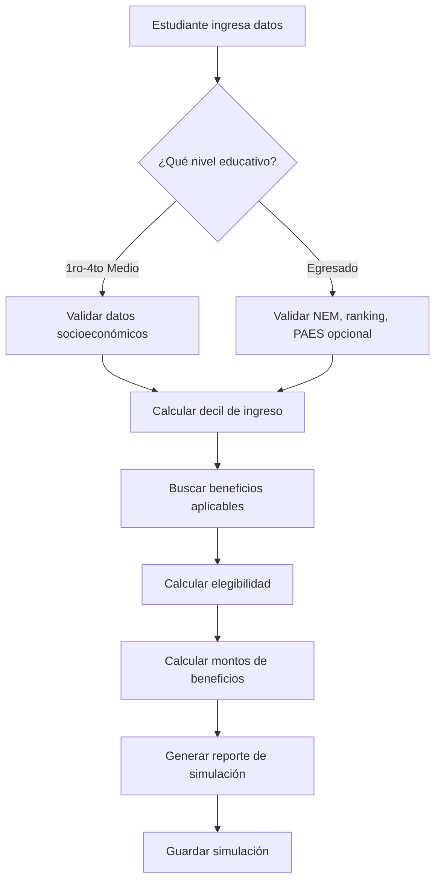

# 🎯 Flujo de Simulación - Simulador UNIACC

## 📋 Resumen Ejecutivo

Este documento describe el flujo completo de simulación de becas y beneficios para el simulador de UNIACC, considerando que **PAES NO es obligatorio** para el ingreso a la universidad.

---

## 🏗️ Arquitectura de la Simulación

### **1. Flujo Principal de Simulación**



### **2. Componentes de la Simulación**

#### **A. Captura de Datos (Frontend)**
- **Formulario paso a paso** con validación en tiempo real
- **Datos personales**: Nombre, email, RUT/pasaporte
- **Datos académicos**: Colegio, carrera deseada, nivel educativo
- **Datos socioeconómicos**: Ingreso familiar, número de integrantes
- **PAES opcional**: Solo si el estudiante rindió

#### **B. Lógica de Cálculo (Backend)**
- **Función `puede_simular()`**: Verificar elegibilidad
- **Función `obtener_beneficios_por_nivel()`**: Beneficios según perfil
- **Función `calcular_decil_ingreso()`**: Determinar decil automáticamente
- **Función `calcular_montos_beneficios()`**: Calcular descuentos/montos

---

## 🎯 Lógica de Cálculo por Perfil

### **Estudiante de Enseñanza Media (1ro-4to Medio)**

#### **Requisitos para Simular:**
- ✅ Datos personales completos
- ✅ Datos académicos básicos (colegio, carrera deseada)
- ✅ Datos socioeconómicos (ingreso familiar)
- ❌ NEM, ranking, PAES (no aplican)

#### **Beneficios Disponibles:**
```sql
SELECT * FROM beneficios_uniacc 
WHERE vigente = true 
AND (
  descripcion ILIKE '%TALENTO%' OR
  descripcion ILIKE '%MIGRANTE%' OR
  descripcion ILIKE '%CONVENIO%' OR
  tipo_beneficio = 'FINANCIERO'
)
ORDER BY prioridad;
```

#### **Beneficios Específicos:**
- **Becas Talento**: Para estudiantes destacados
- **Becas Migrante**: Para estudiantes migrantes
- **Convenios Institucionales**: ADTRES, AMUCH, PDI, FACH
- **Descuentos Financieros**: Por forma de pago

### **Estudiante Egresado**

#### **Requisitos para Simular:**
- ✅ Datos personales completos
- ✅ Datos académicos completos (NEM, ranking obligatorios)
- ✅ Datos socioeconómicos (ingreso familiar)
- ✅ PAES opcional (no obligatorio en UNIACC)

#### **Beneficios Disponibles:**
```sql
SELECT * FROM beneficios_uniacc 
WHERE vigente = true 
AND (
  descripcion ILIKE '%NEM%' OR
  descripcion ILIKE '%DACC%' OR
  descripcion ILIKE '%PSU%' OR
  descripcion ILIKE '%CAE%' OR
  descripcion ILIKE '%TALENTO%' OR
  descripcion ILIKE '%MIGRANTE%' OR
  descripcion ILIKE '%CONVENIO%' OR
  tipo_beneficio IN ('FINANCIERO', 'FINANCIAMIENTO')
)
ORDER BY prioridad;
```

#### **Beneficios Específicos:**
- **Becas por Rendimiento**: NEM, DACC, PSU (opcional)
- **Financiamiento**: CAE, becas MINEDUC
- **Becas Especiales**: Talento, Migrante, Convenios
- **Descuentos**: Por forma de pago, pago anticipado

---

## 💰 Cálculo de Montos

### **A. Tipos de Beneficios**

#### **1. Beneficios por Porcentaje:**
```typescript
function calcularDescuentoPorcentaje(arancelBase: number, porcentaje: number): number {
  return arancelBase * (porcentaje / 100);
}
```

**Ejemplo:**
- Arancel base: $2,500,000
- Beca Talento: 70%
- Descuento: $2,500,000 × 0.70 = $1,750,000

#### **2. Beneficios por Monto Fijo:**
```typescript
function calcularDescuentoMontoFijo(arancelBase: number, montoFijo: number): number {
  return Math.min(montoFijo, arancelBase);
}
```

**Ejemplo:**
- Arancel base: $2,500,000
- Beca Migrante: $4,000,000
- Descuento: min($4,000,000, $2,500,000) = $2,500,000

#### **3. Combinación de Beneficios:**
```typescript
function calcularBeneficiosCombinados(arancelBase: number, beneficios: BeneficioCalculado[]): number {
  let descuentoTotal = 0;
  let arancelRestante = arancelBase;
  
  // Aplicar beneficios por prioridad
  beneficios
    .filter(b => b.elegible)
    .sort((a, b) => a.prioridad - b.prioridad)
    .forEach(beneficio => {
      if (beneficio.porcentajeDescuento) {
        const descuento = arancelRestante * (beneficio.porcentajeDescuento / 100);
        descuentoTotal += descuento;
        arancelRestante -= descuento;
      } else if (beneficio.montoFijo) {
        const descuento = Math.min(beneficio.montoFijo, arancelRestante);
        descuentoTotal += descuento;
        arancelRestante -= descuento;
      }
    });
  
  return descuentoTotal;
}
```

### **B. Priorización de Beneficios**

#### **Orden de Aplicación:**
1. **Prioridad 1**: Becas principales (CAE, NEM, DACC)
2. **Prioridad 2**: Becas complementarias (Talento, Convenios)
3. **Prioridad 3**: Descuentos financieros (Forma de pago)

#### **Reglas de Combinación:**
- **No acumulables**: Becas del mismo tipo
- **Acumulables**: Becas de diferentes tipos
- **Límite**: No exceder el 100% del arancel

---

## 🖥️ Interfaz de Usuario

### **A. Formulario de Simulación (Vue.js)**

#### **Estructura de Componentes:**
```vue
<template>
  <div class="simulador-container">
    <!-- Paso 1: Datos Personales -->
    <DatosPersonales 
      v-if="pasoActual === 1" 
      @siguiente="siguientePaso" 
      @anterior="anteriorPaso"
    />
    
    <!-- Paso 2: Datos Académicos -->
    <DatosAcademicos 
      v-if="pasoActual === 2" 
      @siguiente="siguientePaso" 
      @anterior="anteriorPaso"
    />
    
    <!-- Paso 3: Datos Socioeconómicos -->
    <DatosSocioeconomicos 
      v-if="pasoActual === 3" 
      @siguiente="siguientePaso" 
      @anterior="anteriorPaso"
    />
    
    <!-- Paso 4: PAES (Opcional) -->
    <DatosPAES 
      v-if="pasoActual === 4" 
      @siguiente="siguientePaso" 
      @anterior="anteriorPaso"
    />
    
    <!-- Paso 5: Resultados -->
    <ResultadosSimulacion 
      v-if="pasoActual === 5" 
      :resultados="resultados"
      @nueva-simulacion="reiniciarSimulacion"
    />
  </div>
</template>
```

#### **Validación en Tiempo Real:**
```typescript
// Validación por paso
const validaciones = {
  1: (datos) => validarDatosPersonales(datos),
  2: (datos) => validarDatosAcademicos(datos),
  3: (datos) => validarDatosSocioeconomicos(datos),
  4: (datos) => validarDatosPAES(datos)
};

function validarDatosSimulacion(datos: any): ValidationResult {
  const errores: string[] = [];
  
  if (!datos.nivel_educativo) {
    errores.push('Nivel educativo es requerido');
  }
  
  if (datos.nivel_educativo === 'Egresado') {
    if (!datos.nem) errores.push('NEM es requerido para egresados');
    if (!datos.ranking) errores.push('Ranking es requerido para egresados');
  }
  
  if (!datos.ingreso_mensual) {
    errores.push('Ingreso mensual es requerido');
  }
  
  return {
    valido: errores.length === 0,
    errores
  };
}
```

### **B. Componente de Resultados**

#### **Estructura del Reporte:**
```vue
<template>
  <div class="resultados-simulacion">
    <h2>Resultados de tu Simulación</h2>
    
    <!-- Resumen Financiero -->
    <div class="resumen-financiero">
      <div class="arancel-original">
        <span>Arancel Original:</span>
        <span>${{ formatNumber(arancelBase) }}</span>
      </div>
      <div class="descuento-total">
        <span>Descuento Total:</span>
        <span class="descuento">-${{ formatNumber(descuentoTotal) }}</span>
      </div>
      <div class="arancel-final">
        <span>Arancel Final:</span>
        <span class="destacado">${{ formatNumber(arancelFinal) }}</span>
      </div>
    </div>
    
    <!-- Beneficios Aplicables -->
    <div class="beneficios-aplicables">
      <h3>Beneficios Aplicables</h3>
      <BeneficioCard 
        v-for="beneficio in beneficiosAplicables" 
        :key="beneficio.codigo"
        :beneficio="beneficio"
      />
    </div>
    
    <!-- Beneficios No Aplicables -->
    <div class="beneficios-no-aplicables" v-if="beneficiosNoAplicables.length > 0">
      <h3>Otros Beneficios Disponibles</h3>
      <BeneficioCard 
        v-for="beneficio in beneficiosNoAplicables" 
        :key="beneficio.codigo"
        :beneficio="beneficio"
        :aplicable="false"
      />
    </div>
    
    <!-- Acciones -->
    <div class="acciones">
      <Button @click="nuevaSimulacion" variant="primary">
        Nueva Simulación
      </Button>
      <Button @click="compartirResultados" variant="outline">
        Compartir Resultados
      </Button>
      <Button @click="exportarPDF" variant="outline">
        Exportar PDF
      </Button>
    </div>
  </div>
</template>
```

---

## 🗄️ Almacenamiento de Simulaciones

### **A. Estructura de Datos**

```typescript
interface SimulacionResult {
  estudiante: ProspectoData;
  beneficiosAplicables: BeneficioCalculado[];
  beneficiosNoAplicables: BeneficioCalculado[];
  totalDescuento: number;
  montoFinal: number;
  resumen: ResumenSimulacion;
  fechaSimulacion: Date;
}

interface BeneficioCalculado {
  codigo: number;
  nombre: string;
  tipo: 'BECA' | 'FINANCIAMIENTO' | 'FINANCIERO';
  porcentajeDescuento?: number;
  montoFijo?: number;
  elegible: boolean;
  razonElegibilidad: string;
  montoCalculado: number;
  prioridad: number;
  aplicado: boolean;
}

interface ResumenSimulacion {
  arancelBase: number;
  descuentoTotal: number;
  arancelFinal: number;
  porcentajeDescuento: number;
  numeroBeneficios: number;
  ahorroAnual: number;
}
```

### **B. Persistencia en Base de Datos**

```sql
-- Insertar simulación
INSERT INTO simulaciones (prospecto_id, datos_entrada, resultados, beneficios_aplicables)
VALUES (
  'uuid-del-prospecto',
  '{"nivel_educativo": "Egresado", "nem": 6.5, "ranking": 855.5, "decil": 3}',
  '{"arancel_base": 2500000, "descuento_total": 500000, "arancel_final": 2000000}',
  '[{"codigo": 1760, "nombre": "MC ASIGNATURAS", "descuento": 500000}]'
);
```

---

## 🔧 Funciones de Utilidad

### **A. Formateo de Números**
```typescript
function formatNumber(num: number): string {
  return new Intl.NumberFormat('es-CL', {
    style: 'currency',
    currency: 'CLP',
    minimumFractionDigits: 0
  }).format(num);
}
```

### **B. Cálculo de Decil**
```typescript
function calcularDecil(ingresoMensual: number): number {
  const deciles = [
    { min: 0, max: 81150, decil: 1 },
    { min: 81151, max: 128281, decil: 2 },
    { min: 128282, max: 169998, decil: 3 },
    { min: 169999, max: 211695, decil: 4 },
    { min: 211696, max: 258268, decil: 5 },
    { min: 258269, max: 324984, decil: 6 },
    { min: 324985, max: 412913, decil: 7 },
    { min: 412914, max: 555965, decil: 8 },
    { min: 555966, max: 904199, decil: 9 },
    { min: 904200, max: 999999999, decil: 10 }
  ];
  
  const decil = deciles.find(d => 
    ingresoMensual >= d.min && ingresoMensual <= d.max
  );
  
  return decil ? decil.decil : 5; // Default a decil 5
}
```

### **C. Validación de Elegibilidad**
```typescript
function esElegibleParaBeneficio(
  beneficio: BeneficioUniacc, 
  datosEstudiante: DatosEstudiante
): { elegible: boolean; razon: string } {
  
  // Lógica específica por tipo de beneficio
  switch (beneficio.tipo_beneficio) {
    case 'BECA':
      if (beneficio.descripcion.includes('NEM')) {
        return {
          elegible: datosEstudiante.nem >= 5.0,
          razon: datosEstudiante.nem >= 5.0 
            ? 'Cumple requisitos de NEM' 
            : 'NEM insuficiente'
        };
      }
      break;
      
    case 'FINANCIAMIENTO':
      if (beneficio.descripcion.includes('CAE')) {
        return {
          elegible: true,
          razon: 'Elegible para CAE'
        };
      }
      break;
      
    case 'FINANCIERO':
      return {
        elegible: true,
        razon: 'Descuento por forma de pago'
      };
  }
  
  return {
    elegible: false,
    razon: 'No cumple requisitos'
  };
}
```

---

## 📊 Características Avanzadas

### **A. Simulación en Tiempo Real**
- **Cálculo instantáneo** al cambiar datos
- **Validación en vivo** de campos
- **Sugerencias automáticas** de beneficios
- **Preview de resultados** mientras se completan datos

### **B. Comparación de Escenarios**
- **Múltiples simulaciones** por estudiante
- **Comparación lado a lado** de resultados
- **Análisis de impacto** de cada beneficio
- **Historial de simulaciones**

### **C. Exportación de Resultados**
- **PDF** con resultados detallados
- **Excel** con datos para análisis
- **Compartir por WhatsApp/Email**
- **Código QR** para acceso rápido

### **D. Personalización**
- **Aranceles por carrera** específicos
- **Beneficios por sede** (si aplica)
- **Promociones temporales**
- **Cupones de descuento**

---

## 🚀 Flujo de Implementación

### **Fase 1: Base de Datos**
- ✅ Crear tablas principales
- ✅ Insertar beneficios UNIACC
- ✅ Configurar constraints inteligentes
- ✅ Crear funciones de cálculo

### **Fase 2: Backend (Supabase)**
- 🔄 Crear funciones de simulación
- 🔄 Implementar lógica de cálculo
- 🔄 Configurar Row Level Security
- 🔄 Crear APIs de simulación

### **Fase 3: Frontend (Vue.js)**
- ⏳ Crear componentes de formulario
- ⏳ Implementar validación en tiempo real
- ⏳ Diseñar interfaz de resultados
- ⏳ Integrar con Supabase

### **Fase 4: Testing y Optimización**
- ⏳ Pruebas de simulación
- ⏳ Optimización de rendimiento
- ⏳ Testing de casos edge
- ⏳ Refinamiento de UX

---

## 📈 Métricas de Éxito

### **A. Técnicas**
- **Tiempo de simulación**: < 3 segundos
- **Precisión de cálculo**: 100%
- **Disponibilidad**: 99.9%
- **Tiempo de carga**: < 2 segundos

### **B. Negocio**
- **Conversión**: % de simulaciones que se convierten en matrículas
- **Engagement**: Tiempo promedio en la plataforma
- **Satisfacción**: Rating de la experiencia
- **Adopción**: Número de simulaciones por mes

---

## 🔍 Consideraciones Especiales

### **A. UNIACC - PAES No Obligatorio**
- **Flexibilidad**: Estudiantes pueden simular sin PAES
- **Beneficios amplios**: Acceso a más opciones de financiamiento
- **Inclusividad**: Mayor acceso a educación superior

### **B. Validación de Datos**
- **RUT válido**: Verificación de dígito verificador
- **Email válido**: Formato correcto
- **Rangos numéricos**: NEM (1.0-7.0), Ranking (0-1000)
- **Consistencia**: Datos coherentes entre campos

### **C. Experiencia de Usuario**
- **Progreso visual**: Indicador de pasos completados
- **Guardado automático**: No perder datos
- **Navegación intuitiva**: Fácil de usar
- **Responsive**: Funciona en móviles

---

**Fecha de creación**: Diciembre 2024  
**Versión**: 1.0  
**Autor**: Equipo de Desarrollo UNIACC
