# 🎯 Flujo de Simulación - Simulador UNIACC

## 📋 Resumen Ejecutivo

Este documento describe el flujo completo de simulación de becas y beneficios para el simulador de UNIACC, considerando que **PAES NO es obligatorio** para el ingreso a la universidad. El sistema está diseñado para ser **inclusivo y flexible**, adaptándose a diferentes perfiles de estudiantes y sus circunstancias específicas.

---

## 🏗️ Arquitectura de la Simulación

### **1. Flujo Principal de Simulación**

```mermaid
graph TD
    A[Estudiante ingresa datos] --> B{¿Qué nivel educativo?}
    B -->|1ro-4to Medio| C[Validar datos socioeconómicos]
    B -->|Egresado| D[Validar NEM, ranking, PAES opcional]
    C --> E[Determinar ubicación geográfica]
    D --> E
    E --> F[Calcular decil de ingreso]
    F --> G[Identificar perfil de estudiante]
    G --> H[Buscar beneficios aplicables]
    H --> I[Calcular elegibilidad específica]
    I --> J[Aplicar algoritmo de prelación]
    J --> K[Calcular montos finales]
    K --> L[Generar reporte personalizado]
    L --> M[Guardar simulación]
```



### **2. Componentes de la Simulación**

#### **A. Captura de Datos (Frontend)**
- **Formulario paso a paso** con validación en tiempo real
- **Datos personales**: Nombre, email, RUT/pasaporte, género, nacionalidad
- **Datos académicos**: Colegio, carrera deseada, nivel educativo, año de egreso
- **Datos socioeconómicos**: Decil de ingreso, opciones de financiamiento (CAE, becas estado)
- **PAES opcional**: Solo si el estudiante rindió (egresados)
- **Ubicación geográfica**: Región y comuna (derivada del colegio seleccionado)

#### **B. Lógica de Cálculo (Backend)**
- **Función `puede_simular()`**: Verificar elegibilidad básica
- **Función `identificar_perfil_estudiante()`**: Determinar perfil específico
- **Función `obtener_beneficios_por_perfil()`**: Beneficios según perfil y ubicación
- **Función `calcular_elegibilidad_especifica()`**: Verificar requisitos detallados
- **Función `aplicar_prelacion_becas()`**: Algoritmo de prelación de becas
- **Función `calcular_montos_finales()`**: Cálculo final con aranceles reales

---

## 🎯 Lógica de Cálculo por Perfil

### **1. Identificación de Perfil de Estudiante**

#### **A. Por Nivel Educativo**

##### **Estudiante de Enseñanza Media (1ro-4to Medio)**
- **Perfil**: `ESTUDIANTE_MEDIA`
- **Características**: 
  - Sin NEM, ranking o PAES
  - Enfocado en proyección futura
  - Acceso a becas de talento y convenios
- **Requisitos mínimos**:
- ✅ Datos personales completos
  - ✅ Colegio y carrera de interés
  - ✅ Decil socioeconómico (opcional)

##### **Estudiante Egresado**
- **Perfil**: `ESTUDIANTE_EGRESADO`
- **Características**:
  - Con NEM y ranking obligatorios
  - PAES opcional (no obligatorio en UNIACC)
  - Acceso a todas las becas disponibles
- **Requisitos mínimos**:
  - ✅ Datos personales completos
  - ✅ NEM y ranking
  - ✅ Colegio y carrera
  - ✅ Decil socioeconómico

#### **B. Por Ubicación Geográfica**

##### **Estudiante de Santiago (Región Metropolitana)**
- **Perfil**: `SANTIAGO`
- **Características**:
  - Acceso a todas las becas
  - Sin restricciones geográficas
  - Prioridad en becas de talento
- **Beneficios específicos**:
  - Becas de talento académico
  - Convenios institucionales
  - Descuentos por pago anticipado

##### **Estudiante de Regiones**
- **Perfil**: `REGIONES`
- **Características**:
  - Acceso a becas especiales para regiones
  - Consideraciones de traslado
  - Becas de movilidad estudiantil
- **Beneficios específicos**:
  - Beca de movilidad estudiantil
  - Beca de traslado
  - Convenios regionales

#### **C. Por Perfil Socioeconómico**

##### **Estudiante de Alto Rendimiento (NEM ≥ 6.0)**
- **Perfil**: `ALTO_RENDIMIENTO`
- **Características**:
  - Acceso a becas de excelencia
  - Prioridad en becas de talento
  - Descuentos adicionales
- **Beneficios específicos**:
  - Beca de Excelencia Académica
  - Beca de Talento
  - Descuento por mérito

##### **Estudiante de Decil Bajo (1-4)**
- **Perfil**: `DECIL_BAJO`
- **Características**:
  - Acceso a becas sociales
  - Prioridad en CAE
  - Becas de apoyo económico
- **Beneficios específicos**:
  - Beca Social
  - CAE con mejores condiciones
  - Beca de Apoyo Económico

##### **Estudiante Migrante**
- **Perfil**: `MIGRANTE`
- **Características**:
  - Acceso a becas especiales
  - Consideraciones de documentación
  - Apoyo específico
- **Beneficios específicos**:
  - Beca Migrante
  - Beca de Integración
  - Apoyo en documentación

### **2. Algoritmo de Identificación de Perfil**

```typescript
interface PerfilEstudiante {
  nivelEducativo: 'MEDIA' | 'EGRESADO'
  ubicacion: 'SANTIAGO' | 'REGIONES'
  rendimiento: 'ALTO' | 'MEDIO' | 'BAJO'
  socioeconomico: 'DECIL_BAJO' | 'DECIL_MEDIO' | 'DECIL_ALTO'
  especial: 'MIGRANTE' | 'CONVENIO' | 'TALENTO' | 'NORMAL'
}

function identificarPerfil(datos: FormData): PerfilEstudiante {
  const perfil: PerfilEstudiante = {
    nivelEducativo: datos.nivelEducativo === 'Egresado' ? 'EGRESADO' : 'MEDIA',
    ubicacion: datos.regionResidencia === 'Metropolitana' ? 'SANTIAGO' : 'REGIONES',
    rendimiento: calcularRendimiento(datos),
    socioeconomico: calcularSocioeconomico(datos.decil),
    especial: identificarEspecial(datos)
  }
  
  return perfil
}

function calcularRendimiento(datos: FormData): 'ALTO' | 'MEDIO' | 'BAJO' {
  if (datos.nivelEducativo !== 'Egresado') return 'MEDIO'
  
  const nem = datos.nem || 0
  const ranking = datos.ranking || 0
  
  if (nem >= 6.0 || ranking >= 850) return 'ALTO'
  if (nem >= 5.0 || ranking >= 700) return 'MEDIO'
  return 'BAJO'
}

function calcularSocioeconomico(decil: number): 'DECIL_BAJO' | 'DECIL_MEDIO' | 'DECIL_ALTO' {
  if (decil <= 4) return 'DECIL_BAJO'
  if (decil <= 7) return 'DECIL_MEDIO'
  return 'DECIL_ALTO'
}

function identificarEspecial(datos: FormData): 'MIGRANTE' | 'CONVENIO' | 'TALENTO' | 'NORMAL' {
  if (datos.nacionalidad !== 'Chilena') return 'MIGRANTE'
  if (datos.colegio?.includes('ADTRES') || datos.colegio?.includes('AMUCH')) return 'CONVENIO'
  if (datos.nem && datos.nem >= 6.5) return 'TALENTO'
  return 'NORMAL'
}
```

### **3. Beneficios por Perfil**

#### **A. Matriz de Elegibilidad**

| Perfil | Beca Talento | Beca Migrante | Beca Social | CAE | Convenios | Descuentos |
|--------|--------------|---------------|-------------|-----|-----------|------------|
| MEDIA + SANTIAGO | ✅ | ❌ | ❌ | ❌ | ✅ | ✅ |
| MEDIA + REGIONES | ✅ | ❌ | ❌ | ❌ | ✅ | ✅ |
| EGRESADO + ALTO_RENDIMIENTO | ✅ | ❌ | ❌ | ✅ | ✅ | ✅ |
| EGRESADO + DECIL_BAJO | ❌ | ❌ | ✅ | ✅ | ✅ | ✅ |
| MIGRANTE | ❌ | ✅ | ❌ | ✅ | ✅ | ✅ |
| CONVENIO | ❌ | ❌ | ❌ | ✅ | ✅ | ✅ |

#### **B. Beneficios Específicos por Perfil**

##### **Para Estudiantes de Media (1ro-4to Medio)**
```sql
SELECT * FROM becas_uniacc 
WHERE activa = true 
AND (
  (nivel_aplicable = 'Pregrado' AND max_anos_egreso IS NULL) OR
  (descripcion ILIKE '%TALENTO%' AND requiere_nem = false) OR
  (descripcion ILIKE '%CONVENIO%') OR
  (tipo_descuento = 'porcentaje' AND descuento_porcentaje > 0)
)
ORDER BY prioridad;
```

##### **Para Estudiantes Egresados**
```sql
SELECT * FROM becas_uniacc 
WHERE activa = true 
AND nivel_aplicable = 'Pregrado'
AND (
  (requiere_nem = true AND nem_minimo <= :nem) OR
  (requiere_paes = true AND paes_minimo <= :paes) OR
  (requiere_nem = false AND requiere_paes = false)
)
ORDER BY prioridad;
```

##### **Para Estudiantes de Regiones**
```sql
SELECT * FROM becas_uniacc 
WHERE activa = true 
AND (
  descripcion ILIKE '%MOVILIDAD%' OR
  descripcion ILIKE '%TRASLADO%' OR
  descripcion ILIKE '%REGIONAL%' OR
  (requiere_region_especifica = false)
)
ORDER BY prioridad;
```

##### **Para Estudiantes Migrantes**
```sql
SELECT * FROM becas_uniacc 
WHERE activa = true 
AND (
  descripcion ILIKE '%MIGRANTE%' OR
  descripcion ILIKE '%INTEGRACION%' OR
  (requiere_genero IS NULL AND requiere_region_especifica = false)
)
ORDER BY prioridad;
```

---

## 💰 Cálculo de Montos

### **A. Obtención de Arancel Base**

#### **1. Arancel por Carrera**
```typescript
interface ArancelCarrera {
  arancel_carrera: number
  matricula_carrera: number
  duracion_en_semestres: number
  anio: number
}

function obtenerArancelCarrera(nombreCarrera: string): ArancelCarrera {
  const carrera = carrerasStore.obtenerCarreraPorNombre(nombreCarrera)
  if (!carrera) {
    throw new Error(`Carrera ${nombreCarrera} no encontrada`)
  }
  
  return {
    arancel_carrera: carrera.arancel_carrera || 0,
    matricula_carrera: carrera.matricula_carrera || 0,
    duracion_en_semestres: carrera.duracion_en_semestres || 0,
    anio: carrera.anio || new Date().getFullYear()
  }
}
```

#### **2. Cálculo de Costo Total Anual**
```typescript
function calcularCostoAnual(arancel: ArancelCarrera): number {
  return arancel.arancel_carrera + arancel.matricula_carrera
}

// Ejemplo:
// Arancel: $2,500,000
// Matrícula: $150,000
// Costo Anual: $2,650,000
```

### **B. Algoritmo de Prelación de Becas**

#### **1. Orden de Aplicación (Prelación)**
```typescript
const PRELACION_BECAS = [
  'BECA_MINISTERIAL',      // 1. Beca Ministerial (JG Millas)
  'BECA_INTERNA',          // 2. Beca Interna sobre saldo
  'CAE',                   // 3. CAE
  'DESCUENTO_INTERNO',     // 4. Descuento Interno
  'CONVENIO'               // 5. Convenios
]

function aplicarPrelacionBecas(
  arancelBase: number, 
  becasElegibles: BecasElegibles[]
): CalculoBecas {
  
  let arancelActual = arancelBase
  let descuentoTotal = 0
  const becasAplicadas: BecasElegibles[] = []
  
  // Ordenar por prelación
  const becasOrdenadas = becasElegibles
    .filter(b => b.elegible)
    .sort((a, b) => {
      const prioridadA = PRELACION_BECAS.indexOf(a.beca.codigo_beca)
      const prioridadB = PRELACION_BECAS.indexOf(b.beca.codigo_beca)
      return prioridadA - prioridadB
    })
  
  // Aplicar becas en orden
  for (const beca of becasOrdenadas) {
    const descuento = calcularDescuentoBeca(arancelActual, beca)
    
    if (descuento > 0) {
      arancelActual -= descuento
      descuentoTotal += descuento
      
      becasAplicadas.push({
        ...beca,
        monto_descuento: descuento
      })
    }
  }
  
  return {
    arancel_base: arancelBase,
    becas_aplicadas: becasAplicadas,
    descuento_total: descuentoTotal,
    arancel_final: arancelActual,
    ahorro_total: descuentoTotal
  }
}
```

#### **2. Cálculo de Descuento por Beca**
```typescript
function calcularDescuentoBeca(arancelActual: number, beca: BecasElegibles): number {
  const { beca: datosBeca } = beca
  
  switch (datosBeca.tipo_descuento) {
    case 'porcentaje':
      return arancelActual * (datosBeca.descuento_porcentaje! / 100)
    
    case 'monto_fijo':
      return Math.min(datosBeca.descuento_monto_fijo!, arancelActual)
    
    case 'mixto':
      const porcentaje = arancelActual * (datosBeca.descuento_porcentaje! / 100)
      const montoFijo = Math.min(datosBeca.descuento_monto_fijo!, arancelActual)
      return Math.max(porcentaje, montoFijo)
    
    default:
      return 0
  }
}
```

### **C. Ejemplos de Cálculo por Perfil**

#### **Ejemplo 1: Estudiante Egresado de Alto Rendimiento (Santiago)**
```typescript
// Datos del estudiante
const estudiante = {
  nivelEducativo: 'Egresado',
  nem: 6.5,
  ranking: 900,
  paes: 750,
  decil: 3,
  regionResidencia: 'Metropolitana',
  carrera: 'Ingeniería Comercial'
}

// Arancel base
const arancel = obtenerArancelCarrera('Ingeniería Comercial')
// Arancel: $2,500,000 + Matrícula: $150,000 = $2,650,000

// Becas elegibles
const becasElegibles = [
  { beca: 'Beca Excelencia NEM 6.5+', tipo: 'porcentaje', descuento: 50, prioridad: 1 },
  { beca: 'Beca Talento', tipo: 'porcentaje', descuento: 30, prioridad: 2 },
  { beca: 'CAE', tipo: 'monto_fijo', descuento: 2000000, prioridad: 3 }
]

// Cálculo:
// 1. Beca Excelencia: $2,650,000 × 50% = $1,325,000
//    Arancel restante: $1,325,000
// 2. Beca Talento: $1,325,000 × 30% = $397,500
//    Arancel restante: $927,500
// 3. CAE: min($2,000,000, $927,500) = $927,500
//    Arancel final: $0

// Resultado:
// Descuento total: $2,650,000
// Arancel final: $0
// Ahorro: 100%
```

#### **Ejemplo 2: Estudiante de Media de Regiones**
```typescript
// Datos del estudiante
const estudiante = {
  nivelEducativo: '3ro Medio',
  decil: 5,
  regionResidencia: 'Valparaíso',
  carrera: 'Psicología'
}

// Arancel base
const arancel = obtenerArancelCarrera('Psicología')
// Arancel: $2,200,000 + Matrícula: $150,000 = $2,350,000

// Becas elegibles
const becasElegibles = [
  { beca: 'Beca Movilidad Estudiantil', tipo: 'monto_fijo', descuento: 500000, prioridad: 1 },
  { beca: 'Convenio Regional', tipo: 'porcentaje', descuento: 20, prioridad: 2 }
]

// Cálculo:
// 1. Beca Movilidad: min($500,000, $2,350,000) = $500,000
//    Arancel restante: $1,850,000
// 2. Convenio Regional: $1,850,000 × 20% = $370,000
//    Arancel final: $1,480,000

// Resultado:
// Descuento total: $870,000
// Arancel final: $1,480,000
// Ahorro: 37%
```

#### **Ejemplo 3: Estudiante Migrante**
```typescript
// Datos del estudiante
const estudiante = {
  nivelEducativo: 'Egresado',
  nem: 5.8,
  ranking: 750,
  nacionalidad: 'Venezolana',
  decil: 4,
  regionResidencia: 'Metropolitana',
  carrera: 'Derecho'
}

// Arancel base
const arancel = obtenerArancelCarrera('Derecho')
// Arancel: $2,800,000 + Matrícula: $150,000 = $2,950,000

// Becas elegibles
const becasElegibles = [
  { beca: 'Beca Migrante', tipo: 'monto_fijo', descuento: 1000000, prioridad: 1 },
  { beca: 'Beca Integración', tipo: 'porcentaje', descuento: 25, prioridad: 2 },
  { beca: 'CAE', tipo: 'monto_fijo', descuento: 2000000, prioridad: 3 }
]

// Cálculo:
// 1. Beca Migrante: min($1,000,000, $2,950,000) = $1,000,000
//    Arancel restante: $1,950,000
// 2. Beca Integración: $1,950,000 × 25% = $487,500
//    Arancel restante: $1,462,500
// 3. CAE: min($2,000,000, $1,462,500) = $1,462,500
//    Arancel final: $0

// Resultado:
// Descuento total: $2,950,000
// Arancel final: $0
// Ahorro: 100%
```

### **D. Reglas de Combinación**

#### **1. Becas No Acumulables**
- **Becas del mismo tipo**: Solo se aplica la de mayor beneficio
- **Becas incompatibles**: Se verifica la lista `becas_incompatibles`
- **Límite de cobertura**: No exceder el 100% del arancel

#### **2. Becas Acumulables**
- **Becas de diferentes tipos**: Se pueden combinar
- **Becas complementarias**: Se suman hasta el límite
- **Descuentos adicionales**: Se aplican sobre el saldo restante

#### **3. Validaciones Especiales**
```typescript
function validarCombinacionBecas(becas: BecasElegibles[]): boolean {
  // Verificar incompatibilidades
  for (const beca of becas) {
    if (beca.beca.becas_incompatibles) {
      const incompatibles = becas.filter(b => 
        beca.beca.becas_incompatibles!.includes(b.beca.codigo_beca)
      )
      if (incompatibles.length > 0) {
        return false
      }
    }
  }
  
  // Verificar límite de cobertura
  const descuentoTotal = becas.reduce((sum, b) => sum + b.monto_descuento, 0)
  return descuentoTotal <= arancelBase
}
```

---

## 🖥️ Interfaz de Usuario

### **A. Flujo de Navegación del Simulador**

#### **1. Estructura de Pasos (Wizard)**

##### **Flujo para Estudiantes de Media (1ro-4to Medio)**

```mermaid
graph LR
    A[Paso 1: Bienvenida] --> B[Paso 2: Datos Personales]
    B --> C[Paso 3: Datos de Escuela]
    C --> D[Paso 4: Carrera de Interés]
    D --> E[Paso 5: Situación Socioeconómica]
    E --> F[Paso 6: Resultados]
```


##### **Flujo para Estudiantes Egresados**

```mermaid
graph LR
    A[Paso 1: Bienvenida] --> B[Paso 2: Datos Personales]
    B --> C[Paso 3: Datos de Escuela]
    C --> D[Paso 4: Datos de Egreso]
    D --> E[Paso 5: PAES Opcional]
    E --> F[Paso 6: Situación Socioeconómica]
    F --> G[Paso 7: Resultados]
```


#### **2. Componentes del Formulario**

##### **Paso 1: Bienvenida**
- **Propósito**: Introducir al estudiante al simulador
- **Contenido**: 
  - Explicación del proceso
  - Tiempo estimado (5-10 minutos)
  - Información sobre UNIACC
- **Validación**: Solo requiere continuar

##### **Paso 2: Datos Personales**
```vue
<template>
  <div class="personal-data-step">
    <h2>Datos Personales</h2>
    
    <!-- Información básica -->
    <FormField label="Nombre completo" required>
      <Input v-model="formData.nombre" placeholder="Ingresa tu nombre" />
    </FormField>
    
    <FormField label="Apellidos" required>
      <Input v-model="formData.apellido" placeholder="Ingresa tus apellidos" />
    </FormField>
    
    <FormField label="Email" required>
      <Input v-model="formData.email" type="email" placeholder="tu@email.com" />
    </FormField>
    
    <FormField label="Teléfono" required>
      <Input v-model="formData.telefono" placeholder="+56 9 1234 5678" />
    </FormField>
    
    <!-- Identificación -->
    <FormField label="¿Tienes RUT chileno?">
      <RadioGroup v-model="formData.tieneRUT">
        <RadioGroupItem value="true">Sí, tengo RUT</RadioGroupItem>
        <RadioGroupItem value="false">No, tengo pasaporte</RadioGroupItem>
      </RadioGroup>
    </FormField>
    
    <FormField v-if="formData.tieneRUT === 'true'" label="RUT" required>
      <Input v-model="formData.identificacion" placeholder="12.345.678-9" />
    </FormField>
    
    <FormField v-if="formData.tieneRUT === 'false'" label="Pasaporte" required>
      <Input v-model="formData.identificacion" placeholder="A12345678" />
    </FormField>
    
    <!-- Información adicional -->
    <FormField label="Género">
      <Select v-model="formData.genero">
        <SelectItem value="Masculino">Masculino</SelectItem>
        <SelectItem value="Femenino">Femenino</SelectItem>
        <SelectItem value="Otro">Otro</SelectItem>
        <SelectItem value="Prefiero no decir">Prefiero no decir</SelectItem>
      </Select>
    </FormField>
    
    <FormField label="Nacionalidad" required>
      <Select v-model="formData.nacionalidad">
        <SelectItem value="Chilena">Chilena</SelectItem>
        <SelectItem value="Extranjera">Extranjera</SelectItem>
      </Select>
    </FormField>
  </div>
</template>
```

##### **Paso 3: Datos de Escuela**
```vue
<template>
  <div class="school-data-step">
    <h2>Datos de tu Establecimiento</h2>
    
    <!-- Nivel educativo -->
    <FormField label="¿En qué estado te encuentras?" required>
      <Select v-model="formData.nivelEducativo">
        <SelectItem value="1ro Medio">1ro Medio</SelectItem>
        <SelectItem value="2do Medio">2do Medio</SelectItem>
        <SelectItem value="3ro Medio">3ro Medio</SelectItem>
        <SelectItem value="4to Medio">4to Medio</SelectItem>
        <SelectItem value="Egresado">Egresado</SelectItem>
      </Select>
    </FormField>
    
    <!-- Selección de colegio -->
    <FormField label="Selecciona tu colegio" required>
      <Button @click="abrirModalColegio" variant="outline" class="w-full">
        {{ formData.colegio || 'Buscar colegio...' }}
      </Button>
    </FormField>
    
    <!-- Modal de selección de colegio -->
    <SchoolSelectionModal 
      v-if="mostrarModalColegio"
      @cerrar="cerrarModalColegio"
      @seleccionar="seleccionarColegio"
    />
  </div>
</template>
```

##### **Paso 4: Datos de Egreso (Solo Egresados)**
```vue
<template>
  <div class="graduation-data-step">
    <h2>Datos de Egreso</h2>
    
    <!-- NEM y Ranking -->
    <div class="grid grid-cols-1 md:grid-cols-2 gap-4">
      <FormField label="NEM" required>
        <Input v-model="formData.nem" type="number" step="0.1" min="1.0" max="7.0" />
      </FormField>
      
      <FormField label="Ranking" required>
        <Input v-model="formData.ranking" type="number" step="0.1" min="0" max="1000" />
      </FormField>
    </div>
    
    <FormField label="Año de egreso" required>
      <Select v-model="formData.añoEgreso">
        <SelectItem v-for="año in añosEgreso" :key="año" :value="año">
          {{ año }}
        </SelectItem>
      </Select>
    </FormField>
    
    <!-- PAES opcional -->
    <FormField label="¿Rendiste la PAES?">
      <RadioGroup v-model="formData.rendioPAES">
        <RadioGroupItem :value="true">Sí, rendí la PAES</RadioGroupItem>
        <RadioGroupItem :value="false">No, no rendí la PAES</RadioGroupItem>
      </RadioGroup>
    </FormField>
    
    <!-- Puntajes PAES (si rindió) -->
    <div v-if="formData.rendioPAES" class="paes-scores">
      <h3>Puntajes PAES</h3>
      <div class="grid grid-cols-2 md:grid-cols-4 gap-4">
        <FormField label="Matemática">
          <Input v-model="formData.paes.matematica" type="number" min="100" max="1000" />
        </FormField>
        <FormField label="Lenguaje">
          <Input v-model="formData.paes.lenguaje" type="number" min="100" max="1000" />
        </FormField>
        <FormField label="Ciencias">
          <Input v-model="formData.paes.ciencias" type="number" min="100" max="1000" />
        </FormField>
        <FormField label="Historia">
          <Input v-model="formData.paes.historia" type="number" min="100" max="1000" />
        </FormField>
      </div>
    </div>
    
    <!-- Selección de carrera -->
    <FormField label="Carrera de interés" required>
      <div class="relative">
        <Input 
          v-model="searchTerm" 
          @focus="mostrarDropdown = true"
          placeholder="Buscar carrera..."
        />
        <div v-if="mostrarDropdown" class="career-dropdown">
          <div v-for="carrera in carrerasFiltradas" :key="carrera.id">
            <Button @click="seleccionarCarrera(carrera)" variant="ghost" class="w-full">
              {{ carrera.nombre_carrera }}
            </Button>
          </div>
        </div>
      </div>
    </FormField>
  </div>
</template>
```

##### **Paso 5: Situación Socioeconómica**
```vue
<template>
  <div class="socioeconomic-step">
    <h2>Situación Socioeconómica</h2>
    
    <!-- Opciones de financiamiento -->
    <FormField label="¿Qué opciones de financiamiento consideras?">
      <div class="space-y-4">
        <div class="flex items-center space-x-2">
          <Checkbox v-model="formData.planeaUsarCAE" />
          <Label>CAE (Crédito con Aval del Estado)</Label>
        </div>
        
        <div class="flex items-center space-x-2">
          <Checkbox v-model="formData.usaBecasEstado" />
          <Label>Becas del Estado (MINEDUC)</Label>
        </div>
      </div>
    </FormField>
    
    <!-- Selección de decil (si selecciona financiamiento) -->
    <div v-if="mostrarSeleccionDecil" class="decil-selection">
      <FormField label="Selecciona tu decil socioeconómico" required>
        <Select v-model="formData.decil">
          <SelectItem v-for="decil in deciles" :key="decil.decil" :value="decil.decil">
            {{ decil.decil }}° Decil - {{ formatearRango(decil) }}
          </SelectItem>
        </Select>
      </FormField>
      
      <!-- Información del decil seleccionado -->
      <div v-if="formData.decil" class="decil-info-card">
        <h4>{{ formData.decil }}° Decil</h4>
        <p>Rango de ingresos: {{ formatearRango(selectedDecilInfo) }}</p>
        <p>{{ selectedDecilInfo.descripcion_corta }}</p>
      </div>
    </div>
  </div>
</template>
```

##### **Paso 6/7: Resultados**
```vue
<template>
  <div class="results-step">
    <h2>¡Simulación Completada!</h2>
    
    <!-- Información de la carrera -->
    <div class="career-info">
      <h3>{{ carreraInfo.nombre_carrera }}</h3>
      <p>{{ carreraInfo.descripcion_facultad }}</p>
      <p>{{ carreraInfo.duracion_en_semestres }} semestres</p>
    </div>
    
    <!-- Resumen financiero -->
    <div class="financial-summary">
      <div class="summary-grid">
        <div class="summary-card">
          <h4>Arancel Original</h4>
          <p>{{ formatCurrency(calculoBecas.arancel_base) }}</p>
        </div>
        <div class="summary-card discount">
          <h4>Descuento Total</h4>
          <p>-{{ formatCurrency(calculoBecas.descuento_total) }}</p>
        </div>
        <div class="summary-card final">
          <h4>Arancel Final</h4>
          <p>{{ formatCurrency(calculoBecas.arancel_final) }}</p>
        </div>
      </div>
      
      <div class="savings-card">
        <h3>¡Ahorras {{ formatCurrency(calculoBecas.ahorro_total) }}!</h3>
        <p>{{ porcentajeAhorro }}% de descuento total</p>
      </div>
    </div>
    
    <!-- Becas aplicadas -->
    <div class="benefits-section">
      <h3>Becas Aplicadas</h3>
      <div v-for="beca in becasAplicadas" :key="beca.beca.id" class="benefit-card">
        <h4>{{ beca.beca.nombre }}</h4>
        <p>Descuento: {{ formatCurrency(beca.monto_descuento) }}</p>
        <p>{{ beca.beca.descripcion }}</p>
      </div>
    </div>
    
    <!-- Acciones -->
    <div class="actions">
      <Button @click="nuevaSimulacion" variant="primary">
        Nueva Simulación
      </Button>
      <Button @click="compartirResultados" variant="outline">
        Compartir Resultados
      </Button>
    </div>
  </div>
</template>
```

#### **3. Validación en Tiempo Real**

##### **Validación por Paso**
```typescript
interface ValidationRule {
  field: string
  required: boolean
  validator?: (value: any, data: FormData) => boolean
  message: string
}

const validationRules: Record<number, ValidationRule[]> = {
  1: [ // Datos Personales
    { field: 'nombre', required: true, message: 'Nombre es requerido' },
    { field: 'apellido', required: true, message: 'Apellidos son requeridos' },
    { field: 'email', required: true, validator: validarEmail, message: 'Email inválido' },
    { field: 'telefono', required: true, validator: validarTelefono, message: 'Teléfono inválido' },
    { field: 'identificacion', required: true, validator: validarIdentificacion, message: 'Identificación inválida' },
    { field: 'nacionalidad', required: true, message: 'Nacionalidad es requerida' }
  ],
  2: [ // Datos de Escuela
    { field: 'nivelEducativo', required: true, message: 'Nivel educativo es requerido' },
    { field: 'colegio', required: true, message: 'Colegio es requerido' }
  ],
  3: [ // Datos de Egreso (solo egresados)
    { field: 'nem', required: true, validator: validarNEM, message: 'NEM inválido' },
    { field: 'ranking', required: true, validator: validarRanking, message: 'Ranking inválido' },
    { field: 'añoEgreso', required: true, message: 'Año de egreso es requerido' },
    { field: 'carrera', required: true, message: 'Carrera es requerida' }
  ],
  4: [ // PAES (opcional)
    // Sin validaciones obligatorias
  ],
  5: [ // Situación Socioeconómica
    { field: 'decil', required: false, validator: validarDecil, message: 'Decil inválido' }
  ]
}

function validarEmail(email: string): boolean {
  const regex = /^[^\s@]+@[^\s@]+\.[^\s@]+$/
  return regex.test(email)
}

function validarTelefono(telefono: string): boolean {
  const regex = /^(\+56|56)?[2-9]\d{8}$/
  return regex.test(telefono.replace(/\s/g, ''))
}

function validarIdentificacion(identificacion: string, data: FormData): boolean {
  if (data.tieneRUT === 'true') {
    return validarRUT(identificacion)
  } else {
    return validarPasaporte(identificacion)
  }
}

function validarNEM(nem: number): boolean {
  return nem >= 1.0 && nem <= 7.0
}

function validarRanking(ranking: number): boolean {
  return ranking >= 0 && ranking <= 1000
}

function validarDecil(decil: number): boolean {
  return decil >= 1 && decil <= 10
}
```

##### **Validación Dinámica por Perfil**
```typescript
function validarPasoCompleto(paso: number, datos: FormData): ValidationResult {
  const reglas = validationRules[paso] || []
  const errores: string[] = []
  
  // Validar campos obligatorios
  for (const regla of reglas) {
    const valor = datos[regla.field as keyof FormData]
    
    if (regla.required && (!valor || valor === '')) {
      errores.push(regla.message)
    } else if (valor && regla.validator && !regla.validator(valor, datos)) {
      errores.push(regla.message)
    }
  }
  
  // Validaciones específicas por perfil
  if (paso === 3 && datos.nivelEducativo === 'Egresado') {
    if (!datos.nem) errores.push('NEM es requerido para egresados')
    if (!datos.ranking) errores.push('Ranking es requerido para egresados')
  }
  
  if (paso === 5) {
    const tieneFinanciamiento = datos.planeaUsarCAE || datos.usaBecasEstado
    if (tieneFinanciamiento && !datos.decil) {
      errores.push('Debes seleccionar un decil si planeas usar financiamiento')
    }
  }
  
  return {
    valido: errores.length === 0,
    errores
  }
}
```

### **B. Componente de Resultados**

#### **Estructura del Reporte:**
```vue
<template>
  <div class="resultados-simulacion">
    <h2>Resultados de tu Simulación</h2>
    
    <!-- Resumen Financiero -->
    <div class="resumen-financiero">
      <div class="arancel-original">
        <span>Arancel Original:</span>
        <span>${{ formatNumber(arancelBase) }}</span>
      </div>
      <div class="descuento-total">
        <span>Descuento Total:</span>
        <span class="descuento">-${{ formatNumber(descuentoTotal) }}</span>
      </div>
      <div class="arancel-final">
        <span>Arancel Final:</span>
        <span class="destacado">${{ formatNumber(arancelFinal) }}</span>
      </div>
    </div>
    
    <!-- Beneficios Aplicables -->
    <div class="beneficios-aplicables">
      <h3>Beneficios Aplicables</h3>
      <BeneficioCard 
        v-for="beneficio in beneficiosAplicables" 
        :key="beneficio.codigo"
        :beneficio="beneficio"
      />
    </div>
    
    <!-- Beneficios No Aplicables -->
    <div class="beneficios-no-aplicables" v-if="beneficiosNoAplicables.length > 0">
      <h3>Otros Beneficios Disponibles</h3>
      <BeneficioCard 
        v-for="beneficio in beneficiosNoAplicables" 
        :key="beneficio.codigo"
        :beneficio="beneficio"
        :aplicable="false"
      />
    </div>
    
    <!-- Acciones -->
    <div class="acciones">
      <Button @click="nuevaSimulacion" variant="primary">
        Nueva Simulación
      </Button>
      <Button @click="compartirResultados" variant="outline">
        Compartir Resultados
      </Button>
      <Button @click="exportarPDF" variant="outline">
        Exportar PDF
      </Button>
    </div>
  </div>
</template>
```

---

## 🗄️ Almacenamiento de Simulaciones

### **A. Estructura de Datos**

```typescript
interface SimulacionResult {
  estudiante: ProspectoData;
  beneficiosAplicables: BeneficioCalculado[];
  beneficiosNoAplicables: BeneficioCalculado[];
  totalDescuento: number;
  montoFinal: number;
  resumen: ResumenSimulacion;
  fechaSimulacion: Date;
}

interface BeneficioCalculado {
  codigo: number;
  nombre: string;
  tipo: 'BECA' | 'FINANCIAMIENTO' | 'FINANCIERO';
  porcentajeDescuento?: number;
  montoFijo?: number;
  elegible: boolean;
  razonElegibilidad: string;
  montoCalculado: number;
  prioridad: number;
  aplicado: boolean;
}

interface ResumenSimulacion {
  arancelBase: number;
  descuentoTotal: number;
  arancelFinal: number;
  porcentajeDescuento: number;
  numeroBeneficios: number;
  ahorroAnual: number;
}
```

### **B. Persistencia en Base de Datos**

```sql
-- Insertar simulación
INSERT INTO simulaciones (prospecto_id, datos_entrada, resultados, beneficios_aplicables)
VALUES (
  'uuid-del-prospecto',
  '{"nivel_educativo": "Egresado", "nem": 6.5, "ranking": 855.5, "decil": 3}',
  '{"arancel_base": 2500000, "descuento_total": 500000, "arancel_final": 2000000}',
  '[{"codigo": 1760, "nombre": "MC ASIGNATURAS", "descuento": 500000}]'
);
```

---

## 🔧 Funciones de Utilidad

### **A. Formateo de Números**
```typescript
function formatNumber(num: number): string {
  return new Intl.NumberFormat('es-CL', {
    style: 'currency',
    currency: 'CLP',
    minimumFractionDigits: 0
  }).format(num);
}
```

### **B. Cálculo de Decil**
```typescript
function calcularDecil(ingresoMensual: number): number {
  const deciles = [
    { min: 0, max: 81150, decil: 1 },
    { min: 81151, max: 128281, decil: 2 },
    { min: 128282, max: 169998, decil: 3 },
    { min: 169999, max: 211695, decil: 4 },
    { min: 211696, max: 258268, decil: 5 },
    { min: 258269, max: 324984, decil: 6 },
    { min: 324985, max: 412913, decil: 7 },
    { min: 412914, max: 555965, decil: 8 },
    { min: 555966, max: 904199, decil: 9 },
    { min: 904200, max: 999999999, decil: 10 }
  ];
  
  const decil = deciles.find(d => 
    ingresoMensual >= d.min && ingresoMensual <= d.max
  );
  
  return decil ? decil.decil : 5; // Default a decil 5
}
```

### **C. Validación de Elegibilidad**
```typescript
function esElegibleParaBeneficio(
  beneficio: BeneficioUniacc, 
  datosEstudiante: DatosEstudiante
): { elegible: boolean; razon: string } {
  
  // Lógica específica por tipo de beneficio
  switch (beneficio.tipo_beneficio) {
    case 'BECA':
      if (beneficio.descripcion.includes('NEM')) {
        return {
          elegible: datosEstudiante.nem >= 5.0,
          razon: datosEstudiante.nem >= 5.0 
            ? 'Cumple requisitos de NEM' 
            : 'NEM insuficiente'
        };
      }
      break;
      
    case 'FINANCIAMIENTO':
      if (beneficio.descripcion.includes('CAE')) {
        return {
          elegible: true,
          razon: 'Elegible para CAE'
        };
      }
      break;
      
    case 'FINANCIERO':
      return {
        elegible: true,
        razon: 'Descuento por forma de pago'
      };
  }
  
  return {
    elegible: false,
    razon: 'No cumple requisitos'
  };
}
```

---

## 📊 Características Avanzadas

### **A. Simulación en Tiempo Real**
- **Cálculo instantáneo** al cambiar datos
- **Validación en vivo** de campos
- **Sugerencias automáticas** de beneficios
- **Preview de resultados** mientras se completan datos

### **B. Comparación de Escenarios**
- **Múltiples simulaciones** por estudiante
- **Comparación lado a lado** de resultados
- **Análisis de impacto** de cada beneficio
- **Historial de simulaciones**

### **C. Exportación de Resultados**
- **PDF** con resultados detallados
- **Excel** con datos para análisis
- **Compartir por WhatsApp/Email**
- **Código QR** para acceso rápido

### **D. Personalización**
- **Aranceles por carrera** específicos
- **Beneficios por sede** (si aplica)
- **Promociones temporales**
- **Cupones de descuento**

---

## 🚀 Flujo de Implementación

### **Fase 1: Base de Datos**
- ✅ Crear tablas principales
- ✅ Insertar beneficios UNIACC
- ✅ Configurar constraints inteligentes
- ✅ Crear funciones de cálculo

### **Fase 2: Backend (Supabase)**
- 🔄 Crear funciones de simulación
- 🔄 Implementar lógica de cálculo
- 🔄 Configurar Row Level Security
- 🔄 Crear APIs de simulación

### **Fase 3: Frontend (Vue.js)**
- ⏳ Crear componentes de formulario
- ⏳ Implementar validación en tiempo real
- ⏳ Diseñar interfaz de resultados
- ⏳ Integrar con Supabase

### **Fase 4: Testing y Optimización**
- ⏳ Pruebas de simulación
- ⏳ Optimización de rendimiento
- ⏳ Testing de casos edge
- ⏳ Refinamiento de UX

---

## 📈 Métricas de Éxito

### **A. Técnicas**
- **Tiempo de simulación**: < 3 segundos
- **Precisión de cálculo**: 100%
- **Disponibilidad**: 99.9%
- **Tiempo de carga**: < 2 segundos

### **B. Negocio**
- **Conversión**: % de simulaciones que se convierten en matrículas
- **Engagement**: Tiempo promedio en la plataforma
- **Satisfacción**: Rating de la experiencia
- **Adopción**: Número de simulaciones por mes

---

## 🔍 Consideraciones Especiales

### **A. UNIACC - PAES No Obligatorio**
- **Flexibilidad**: Estudiantes pueden simular sin PAES
- **Beneficios amplios**: Acceso a más opciones de financiamiento
- **Inclusividad**: Mayor acceso a educación superior
- **Ventaja competitiva**: Diferencia clave vs otras universidades

### **B. Perfiles Específicos de Estudiantes**

#### **Estudiantes de Regiones**
- **Becas especiales**: Movilidad estudiantil, traslado
- **Consideraciones logísticas**: Costos de traslado, alojamiento
- **Apoyo adicional**: Orientación sobre vida en Santiago
- **Convenios regionales**: Acuerdos con instituciones locales

#### **Estudiantes Migrantes**
- **Documentación especial**: Validación de documentos extranjeros
- **Becas de integración**: Apoyo específico para adaptación
- **Asesoría legal**: Orientación sobre trámites migratorios
- **Red de apoyo**: Conexión con otros estudiantes migrantes

#### **Estudiantes de Alto Rendimiento**
- **Becas de excelencia**: Descuentos por mérito académico
- **Programas especiales**: Acceso a programas de investigación
- **Mentorías**: Apoyo de profesores destacados
- **Oportunidades de liderazgo**: Participación en actividades especiales

#### **Estudiantes de Decil Bajo**
- **Becas sociales**: Apoyo económico prioritario
- **CAE preferencial**: Mejores condiciones de crédito
- **Apoyo integral**: Orientación académica y personal
- **Red de apoyo**: Programas de acompañamiento

### **C. Validación de Datos Inteligente**

#### **Validación de RUT Chileno**
```typescript
function validarRUT(rut: string): boolean {
  // Limpiar RUT
  const rutLimpio = rut.replace(/[^0-9kK]/g, '')
  
  if (rutLimpio.length < 8) return false
  
  const cuerpo = rutLimpio.slice(0, -1)
  const dv = rutLimpio.slice(-1).toUpperCase()
  
  // Calcular dígito verificador
  let suma = 0
  let multiplicador = 2
  
  for (let i = cuerpo.length - 1; i >= 0; i--) {
    suma += parseInt(cuerpo[i]) * multiplicador
    multiplicador = multiplicador === 7 ? 2 : multiplicador + 1
  }
  
  const resto = suma % 11
  const dvCalculado = resto === 0 ? '0' : resto === 1 ? 'K' : (11 - resto).toString()
  
  return dv === dvCalculado
}
```

#### **Validación de Pasaporte**
```typescript
function validarPasaporte(pasaporte: string): boolean {
  // Formato básico: letra seguida de 7-8 dígitos
  const regex = /^[A-Z]\d{7,8}$/
  return regex.test(pasaporte.toUpperCase())
}
```

#### **Validación de Email**
```typescript
function validarEmail(email: string): boolean {
  const regex = /^[a-zA-Z0-9._%+-]+@[a-zA-Z0-9.-]+\.[a-zA-Z]{2,}$/
  return regex.test(email)
}
```

#### **Validación de Teléfono Chileno**
```typescript
function validarTelefonoChileno(telefono: string): boolean {
  // Limpiar número
  const numeroLimpio = telefono.replace(/[^0-9]/g, '')
  
  // Formato: 9 dígitos (celular) o 8 dígitos (fijo)
  if (numeroLimpio.length === 9) {
    return numeroLimpio.startsWith('9')
  } else if (numeroLimpio.length === 8) {
    return numeroLimpio.startsWith('2')
  }
  
  return false
}
```

### **D. Experiencia de Usuario Avanzada**

#### **Progreso Visual Inteligente**
- **Indicador de pasos**: Muestra progreso actual
- **Validación en tiempo real**: Campos se validan mientras se escriben
- **Sugerencias contextuales**: Ayuda específica por perfil de estudiante
- **Guardado automático**: Datos se guardan cada 30 segundos

#### **Navegación Adaptativa**
- **Flujo dinámico**: Pasos cambian según perfil del estudiante
- **Validación progresiva**: Solo valida campos relevantes
- **Retroalimentación inmediata**: Mensajes de error claros y útiles
- **Ayuda contextual**: Tooltips y explicaciones en cada campo

#### **Diseño Responsive**
- **Mobile-first**: Optimizado para dispositivos móviles
- **Breakpoints inteligentes**: Adaptación fluida a diferentes pantallas
- **Touch-friendly**: Botones y campos optimizados para touch
- **Accesibilidad**: Cumple estándares WCAG 2.1

### **E. Consideraciones de Rendimiento**

#### **Carga Optimizada**
- **Lazy loading**: Componentes se cargan solo cuando se necesitan
- **Caching inteligente**: Datos se cachean para consultas repetidas
- **Compresión**: Assets optimizados para carga rápida
- **CDN**: Contenido estático servido desde CDN

#### **Simulación Eficiente**
- **Cálculo en background**: Simulación no bloquea la UI
- **Debouncing**: Evita cálculos innecesarios
- **Memoización**: Resultados se cachean para reutilización
- **Progressive enhancement**: Funciona sin JavaScript (básico)

### **F. Seguridad y Privacidad**

#### **Protección de Datos**
- **Encriptación**: Datos sensibles encriptados en tránsito y reposo
- **GDPR compliance**: Cumple regulaciones de privacidad
- **Consentimiento explícito**: Usuario acepta uso de datos
- **Retención limitada**: Datos se eliminan después de 2 años

#### **Validación de Seguridad**
- **Sanitización**: Inputs se limpian antes de procesar
- **Rate limiting**: Previene abuso del sistema
- **CSRF protection**: Tokens de seguridad en formularios
- **XSS prevention**: Contenido se escapa apropiadamente

---

---

## 📚 Documentación Técnica

### **A. Arquitectura del Sistema**
- **Frontend**: Vue.js 3 + TypeScript + Tailwind CSS
- **Backend**: Supabase (PostgreSQL + APIs)
- **Estado**: Pinia (Vuex 5)
- **UI**: Shadcn-vue + Lucide Icons
- **Validación**: Zod + Custom validators
- **Testing**: Vitest + Vue Test Utils

### **B. Estructura de Base de Datos**
- **prospectos**: Datos personales de estudiantes
- **datos_academicos**: Información académica (NEM, ranking, PAES)
- **datos_socioeconomicos**: Información socioeconómica (decil, financiamiento)
- **carreras**: Catálogo de carreras con aranceles
- **becas_uniacc**: Catálogo de becas y beneficios
- **deciles**: Información de deciles socioeconómicos
- **colegios**: Catálogo de establecimientos educacionales
- **simulaciones**: Historial de simulaciones realizadas

### **C. APIs y Endpoints**
- **GET /carreras**: Lista de carreras disponibles
- **GET /becas**: Lista de becas activas
- **GET /deciles**: Información de deciles
- **GET /colegios**: Lista de colegios por región/comuna
- **POST /simulacion**: Ejecutar simulación
- **GET /simulacion/:id**: Obtener resultado de simulación

### **D. Flujo de Datos**
1. **Captura**: Usuario completa formulario paso a paso
2. **Validación**: Datos se validan en tiempo real
3. **Perfilado**: Sistema identifica perfil del estudiante
4. **Cálculo**: Algoritmo de prelación aplica becas
5. **Resultado**: Genera reporte personalizado
6. **Persistencia**: Guarda simulación en base de datos

---

## 🔧 Configuración de Datos por Defecto

### **Valores Iniciales del Formulario**

El simulador inicia con los siguientes valores por defecto:

#### **Campos Obligatorios (Sin Valor por Defecto)**
- **Nivel Educativo**: `''` (vacío) - Selección obligatoria
- **Región de Residencia**: `''` (vacío) - Se obtiene del colegio seleccionado
- **Region ID**: `null` - Se obtiene del colegio seleccionado

#### **Campos con Valores por Defecto**
- **Tipo de Programa**: `'Regular'` - Todos los programas son regulares en este MVP
- **Planea Usar CAE**: `false` - Opcional
- **Usa Becas Estado**: `false` - Opcional
- **Rendió PAES**: `false` - Opcional

### **Lógica de Ubicación Geográfica**

**Importante**: La región del prospecto puede ser cualquier región del país, no necesariamente Metropolitana:

- **UNIACC**: Ubicada en Región Metropolitana (todas las sedes)
- **Prospecto**: Puede estar en cualquier región del país
- **Becas**: Dependen de la región del prospecto, no de la ubicación de la universidad

#### **Ejemplos de Aplicación de Becas Regionales**
- **Prospecto en RM (region_id = 13)**: No aplica "Beca Apoyo Regional"
- **Prospecto en Valparaíso (region_id = 5)**: Aplica "Beca Apoyo Regional" automáticamente
- **Prospecto en Antofagasta (region_id = 2)**: Aplica "Beca Apoyo Regional" automáticamente

---

**Fecha de creación**: Diciembre 2024  
**Versión**: 2.0  
**Autor**: Equipo de Desarrollo UNIACC  
**Última actualización**: Diciembre 2024  
**Estado**: En desarrollo activo
